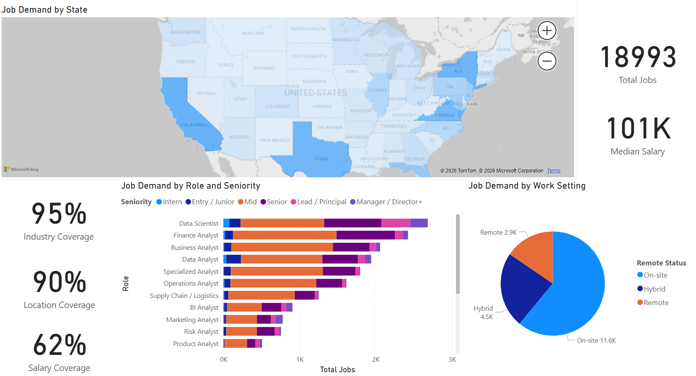

# US Analytics Job Market — Live Dashboard

**[→ Open the live dashboard](https://app.powerbi.com/view?r=eyJrIjoiOWZiMDdkZmYtMjkwMC00Y2IxLWJiYjUtN2JiNzQwM2M2ODFiIiwidCI6IjM1MjZmMGY4LTAxODctNGRhNC1iMjQxLWVmMTZiYTA2YThmZSJ9&embedImagePlaceholder=true&pageName=8eba4ff10000110a8671)**



A daily pipeline that collects US analytics job postings, extracts structured
fields from the free text, and serves them through an eight-page Power BI
report. Runs unattended on GitHub Actions. ~19,000 postings and counting,
collected since 26 May 2026.

I built it because I was searching for analyst roles myself and wanted to know
what the market actually asks for, rather than what people say it asks for.

---

## What the data says

**SQL and Excel are the baseline** — each appears in roughly a third of
postings, ahead of Python and any BI tool. Python (~2,800), Power BI (~2,500)
and Tableau (~2,000) round out the core four.

**Data Scientist pays the most and posts the most** — 2,576 postings (14% of
the dataset) at a $150k median. Unusual, since the best-paid roles are normally
the scarcest. It pulls the overall median to $101k; without it, $95k. Every
other role sits between $86k and $114k.

**"Data Analyst" isn't the best-paid analyst title** — $94k, below Business,
Risk and Marketing Analyst (all ~$100k) and well below Analytics / Insights
($108k). The generalist title pays less than the specialist ones.

**Finance is a bigger analyst employer than the framing suggests** — Finance
Analyst is the second-largest role at 2,318 postings, ahead of both Business
Analyst and Data Analyst.

**Where the jobs are isn't where the money is** — New York and DC lead on
volume by a wide margin; Sunnyvale, Mountain View and San Jose lead on pay.

**Remote is less common than expected** — under a fifth fully remote, about a
quarter hybrid.

The dashboard's Key Findings page carries the full set with the charts behind
them.

---

## How it works

```
JSearch API  →  Gemini  →  BigQuery  →  Power BI
(13 searches)   (extract)   (2 views)    (8 pages)
     │                          │
     └── GitHub Actions, daily  └── cleaning, dedup, categorisation
```

- **Collection** — a Python script runs every morning on GitHub Actions,
  querying 13 analyst-related searches six pages deep.
- **Extraction** — JSearch returns incomplete records, so each posting also
  goes through Gemini, which reads the description and pulls out skills,
  tools, salary, education and work arrangement. Where JSearch's own
  structured fields are stronger (work arrangement, education) they override
  the model.
- **Cleaning** — two BigQuery views handle normalisation, deduplication,
  role categorisation and the relevance filter, so anything new gets the same
  treatment automatically.
- **Serving** — Power BI imports the views and refreshes daily.

---

## Three problems worth describing

**The API changed version and failed silently.** In early September JSearch
retired the endpoint I was calling and it started returning 404. My script was
built to log a failed query and move on — sensible when one query fails,
useless when all thirteen do. It finished normally every morning and GitHub
Actions showed green for eight days while collecting nothing. I found it
because the job count on the dashboard stopped moving. Failed requests now log
the status code, and the run summary reports how many postings were collected,
so an empty run is obvious at a glance.

**A deduplication bug that had been running for months.** The pipeline matched
duplicates on the API's `job_id`. That field turned out to be a search-result
token the API regenerates on every call, not an identifier for the posting — so
the same job came back with a different value each time and cross-run matching
never matched anything. One posting was collected eleven times over three
months. Both layers now key on the posting URL, which doesn't depend on the
provider's ID scheme staying put.

**Six sources became one.** The first version pulled from six free job APIs —
about 40,000 rows, most of it nulls and duplicates. Daily collection hit 100k
postings within days, against a BLS projection of roughly 24,800 data scientist
openings a year across the whole US economy. The AI assistant helping me build
the pipeline insisted the numbers were fine. I didn't buy it and went to check
the raw table myself — deduplication wasn't working at all, and most of what I
had was the same postings repeated. Cutting back to a single paid source left
rows that were each complete enough to analyse, and the quality jump was
immediate.

---

## Stack

Python · JSearch API · Gemini API · BigQuery · Power BI · GitHub Actions

## Repo

```
cloud_pipeline.py                  collection + enrichment
.github/workflows/                 daily schedule
SQL/v_dashboard.sql                cleaning, dedup, categorisation
SQL/v_skills_exploded.sql          skill normalisation
```

## Limitations

62% of postings list a salary, 89% a city, 95% an industry. Gemini's free tier
caps enrichment at roughly 500 postings a day against ~650 collected.
Deduplication can't catch the same job cross-posted to different platforms
under different URLs. The dashboard's Methodology page documents these in full,
along with what I'd do next.